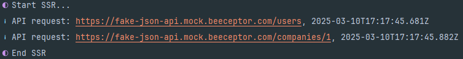

# Nuxt SSR API logger

[![npm version][npm-version-src]][npm-version-href]
[![npm downloads][npm-downloads-src]][npm-downloads-href]
[![License][license-src]][license-href]
[![Nuxt][nuxt-src]][nuxt-href]

The Nuxt SSR API logger helps you see when your Nuxt application sends an API request via SSR.



## Features
- 👁️ Show log information only on development mode


## Quick Setup

Install the module to your Nuxt application with one command:

```bash
npx nuxi module add nuxt-ssr-api-logger
```

That's it! You can now use Nuxt SSR API logger in your Nuxt app ✨


## Contribution

<details>
  <summary>Local development</summary>
  
  ```bash
  # Install dependencies
  npm install
  
  # Generate type stubs
  npm run dev:prepare
  
  # Develop with the playground
  npm run dev
  
  # Build the playground
  npm run dev:build
  
  # Run ESLint
  npm run lint
  
  # Run Vitest
  npm run test
  npm run test:watch
  
  # Release new version
  npm run release
  ```

</details>


<!-- Badges -->
[npm-version-src]: https://img.shields.io/npm/v/nuxt-ssr-api-logger/latest.svg?style=flat&colorA=020420&colorB=00DC82
[npm-version-href]: https://npmjs.com/package/nuxt-ssr-api-logger

[npm-downloads-src]: https://img.shields.io/npm/dm/nuxt-ssr-api-logger.svg?style=flat&colorA=020420&colorB=00DC82
[npm-downloads-href]: https://npm.chart.dev/nuxt-ssr-api-logger

[license-src]: https://img.shields.io/npm/l/nuxt-ssr-api-logger.svg?style=flat&colorA=020420&colorB=00DC82
[license-href]: https://npmjs.com/package/nuxt-ssr-api-logger

[nuxt-src]: https://img.shields.io/badge/Nuxt-020420?logo=nuxt.js
[nuxt-href]: https://nuxt.com
