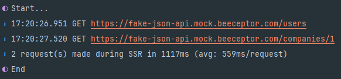

<!--
Get your module up and running quickly.

Find and replace all on all files (CMD+SHIFT+F):
- Name: SSR API logger
- Package name: ssr-api-logger
- Description: My new Nuxt module
-->

# SSR API logger

[![npm version][npm-version-src]][npm-version-href]
[![npm downloads][npm-downloads-src]][npm-downloads-href]
[![License][license-src]][license-href]
[![Nuxt][nuxt-src]][nuxt-href]

The SSR API logger module helps for you, that you will see when send to your Nuxt app API request through SSR. This module logging the terminal only development mode.



## Features

<!-- Highlight some of the features your module provide here -->
- ⛰ &nbsp;Show in development 


## Quick Setup

Install the module to your Nuxt application with one command:

```bash
npx nuxi module add ssr-api-logger
```

That's it! You can now use SSR API logger in your Nuxt app ✨


## Contribution

<details>
  <summary>Local development</summary>
  
  ```bash
  # Install dependencies
  npm install
  
  # Generate type stubs
  npm run dev:prepare
  
  # Develop with the playground
  npm run dev
  
  # Build the playground
  npm run dev:build
  
  # Run ESLint
  npm run lint
  
  # Run Vitest
  npm run test
  npm run test:watch
  
  # Release new version
  npm run release
  ```

</details>


<!-- Badges -->
[npm-version-src]: https://img.shields.io/npm/v/ssr-api-logger/latest.svg?style=flat&colorA=020420&colorB=00DC82
[npm-version-href]: https://npmjs.com/package/ssr-api-logger

[npm-downloads-src]: https://img.shields.io/npm/dm/ssr-api-logger.svg?style=flat&colorA=020420&colorB=00DC82
[npm-downloads-href]: https://npm.chart.dev/ssr-api-logger

[license-src]: https://img.shields.io/npm/l/ssr-api-logger.svg?style=flat&colorA=020420&colorB=00DC82
[license-href]: https://npmjs.com/package/ssr-api-logger

[nuxt-src]: https://img.shields.io/badge/Nuxt-020420?logo=nuxt.js
[nuxt-href]: https://nuxt.com
